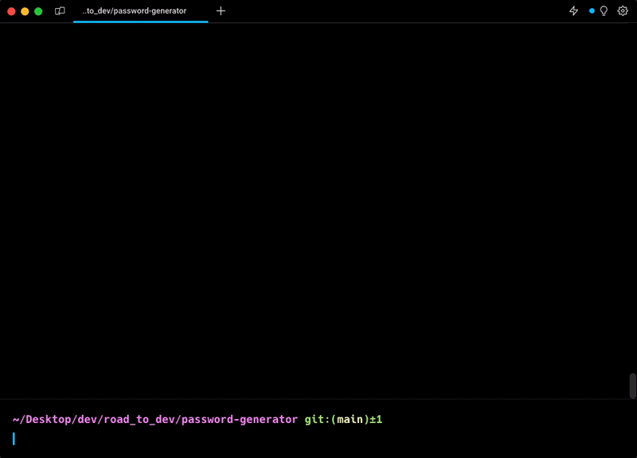

# Random Password Generator

This is a simple project that generates random passwords of a given length and type. The project provides the following features:

- Generate passwords with letters, numbers, and special characters.
- Save generated passwords to a CSV file.
- Print saved passwords.

The program also works in a loop, allowing the user to generate new passwords or print the saved passwords at the end.

## Usage

1. Run the `password_generator.py` script.
2. The program will generate a random password and display it.
3. You will be prompted to decide if you want to change the password.
4. If you choose to change the password, you can input the desired length and type for the new password.
5. After generating the password, you can choose to save it to a CSV file by providing a name for the password.
6. At the end of the loop, you can decide to generate a new password or print the saved passwords.

## Functions

### `generate_password(length=9, password_type="LNS")`

Generate a random password.

- `length` (int): Length of the password (default 9).
- `password_type` (str): Type of the password (default "LNS").
  - "L": Letters (upper and lower case).
  - "N": Numbers.
  - "S": Special characters.

Returns the generated password as a string.

### `change_password()`

Change the password by prompting the user for the length and type of the password.

### `save_password(password, password_name)`

Save a password to a CSV file.

- `password` (str): The password to save.
- `password_name` (str): The name of the password.

### `print_passwords()`

Print the passwords saved in the CSV file.

## File Structure

- `main.py`: The main script that contains the password generation loop and user interactions.
- `passwords.csv`: The CSV file where passwords are saved.
